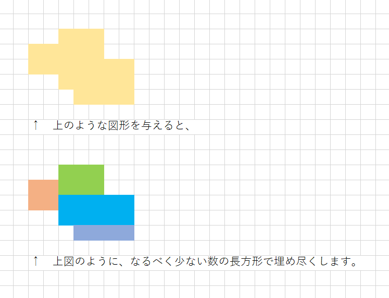
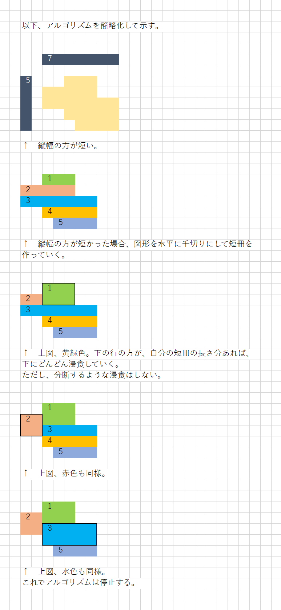

# divide-into-fewer-rectangles

方眼紙を塗りつぶして描いた図形を与えると、  
少ない数の長方形に分けるアルゴリズムです。  
詳しくは、例を見てください。  


## 例１

### 概要

  


### 実行例

Input:  

```shell
py main.py
```

Output:  

```plaintext
横幅、縦幅のあとに図形を続けてください。

EXAMPLE
-------
7 5
..xxx..
xxxxx..
xxxxxxx
..xxxxx
...xxxx

INPUT
-----
7 5
..xxx..
xxxxx..
xxxxxxx
..xxxxx
...xxxx

OUTPUT
------
0011100
2211100
2233333
0033333
0005555
```

### アルゴリズム解説

  


## その他の実行例

* 📖 [実行例２](./docs/example2.md)
* 📖 [実行例３](./docs/example3.md)
