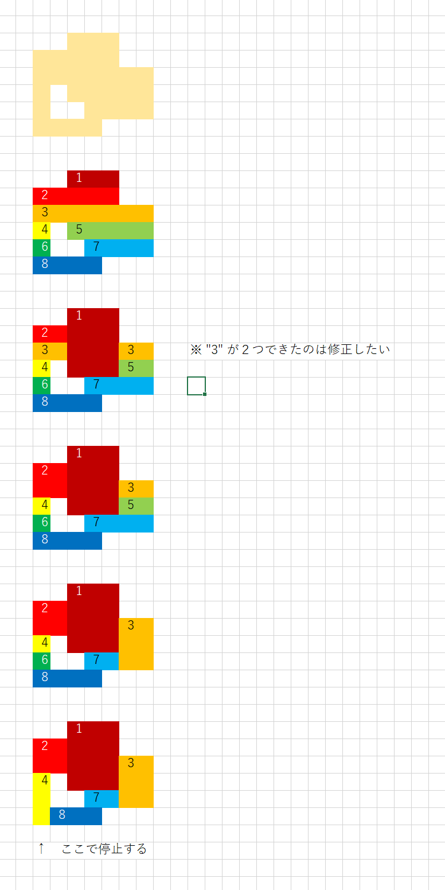

# 実行例２

Input:  

```shell
py main.py
```

Output:  

```plaintext
横幅、縦幅のあとに図形を続けてください。
EXAMPLE
-------

7 5
..xxx..
xxxxx..
xxxxxxx
..xxxxx
...xxxx

INPUT
-----

7 6
..xxx..
xxxxx..
xxxxxxx
x.xxxxx
x..xxxx
xxxx...

RESULT
------
0011100
2211100
2211133
4011133
4007733
4888000
```


## アルゴリズム解説

  
