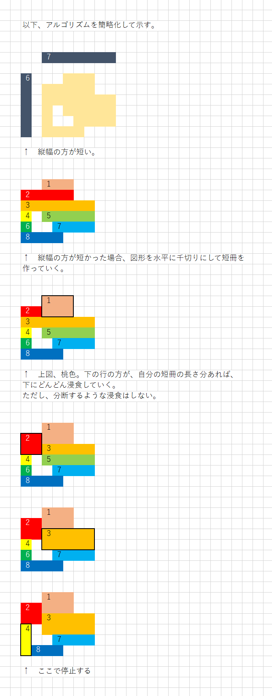

# 例２


## 概要

  


## 実行例

Input:  

```shell
py main.py
```

Output:  

```plaintext
横幅、縦幅のあとに図形を続けてください。

EXAMPLE
-------
7 5
..xxx..
xxxxx..
xxxxxxx
..xxxxx
...xxxx

INPUT
-----
7 6
..xxx..
xxxxx..
xxxxxxx
x.xxxxx
x..xxxx
xxxx...

OUTPUT
------
0011100
2211100
2233333
4033333
4007777
4888000
```


## アルゴリズム解説

  
