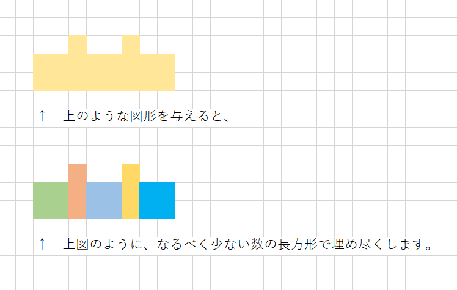
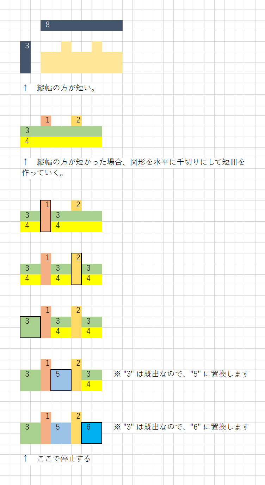

# 例３

## 概要

  


# 実行例３

Input:  

```shell
py main.py
```

Output:  

```plaintext
横幅、縦幅のあとに図形を続けてください。

EXAMPLE
-------
7 5
..xxx..
xxxxx..
xxxxxxx
..xxxxx
...xxxx

INPUT
-----
8 3
..x..x..
xxxxxxxx
xxxxxxxx

OUTPUT
------
00100200
33333333
33333333
```


## アルゴリズム解説

  
